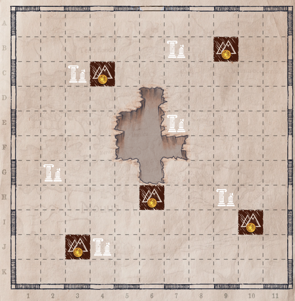
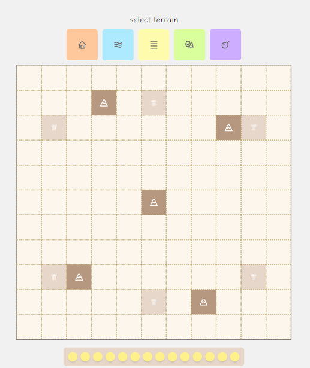

# Cartographers helper

This was thought as an add-on to the board game Cartographers.

It is developed using React and TypeScript and [deployed in Railway](https://cartographer-helper-production.up.railway.app).

Cartographers is a roleplaying writing game consisting of a map in a sheet of paper where the player has to draw shapes to fulfill missions.

These sheets are limited, so I wanted to make a helper iPad-friendly resource that could act as a sheet and where the player could play just as they would on paper. This would act as an extension of the board game and not replace it, so the players would still need the physical game to play, as it contains all the quests and other cards necessary.

The player can launch the website on their iPad, select terrains from the upper selector and place them on the map. They can also touch the coins to mark them as obtained.

This would be the MVP as it allows the player a very similar experience to the paper but digitally.

v1.1 will include:

- Punctuation area for the player to fill out
- Automatic mode that will allow the player to choose the mission they have active and the web will automatically fill out their punctuation for the round. 